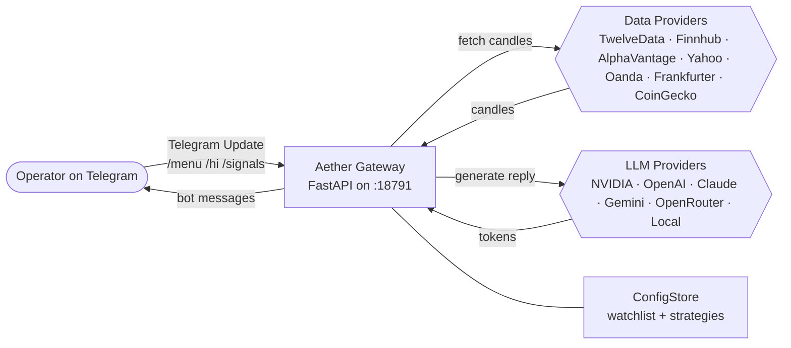
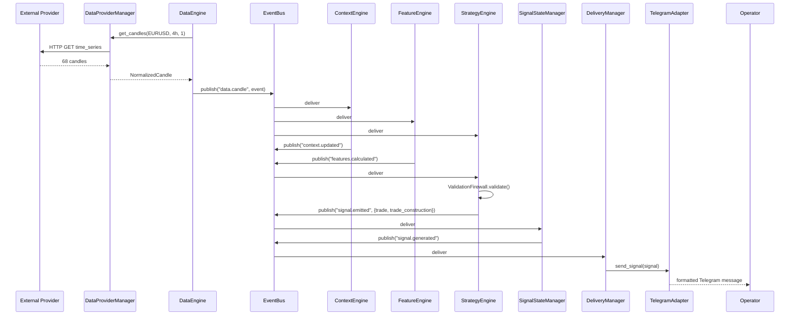
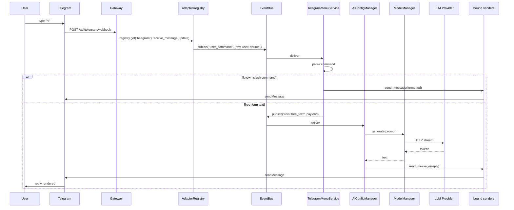
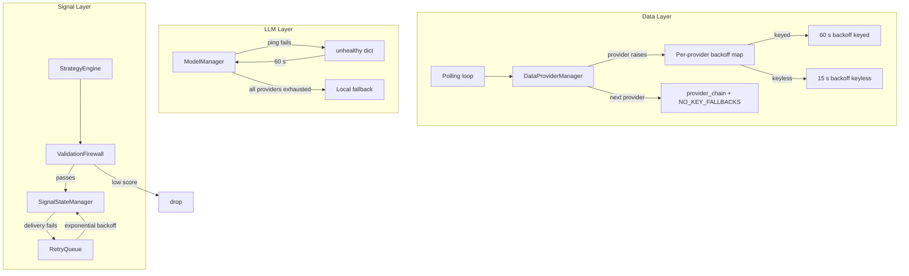

# Aether Data-Flow Pipeline

This document describes every component that touches a piece of data on its
way from a market event to a Telegram message, with diagrams and per-component
purpose tables.

Last updated: 2026-06-03

---

## 1. System Context

External actors (operator, market data, AI providers) and the Aether
subsystems that interact with them.



| Component        | Purpose                                                              |
|------------------|----------------------------------------------------------------------|
| Operator         | The end user interacting with Aether via Telegram.                   |
| Gateway          | FastAPI process hosting the dashboard and Telegram webhook.          |
| Watchlist        | Persistent list of symbols the platform monitors.                    |
| LLM Providers    | External AI services used for natural-language replies.              |
| Data Providers   | External market data sources (some need API keys, some don't).        |

---

## 2. Signal Pipeline (happy path)

The flow of a single market candle all the way to a Telegram signal
message, when every subsystem is healthy.



| Component         | Purpose                                                                |
|-------------------|------------------------------------------------------------------------|
| DataProviderManager | Walks the configured chain, returns the first healthy provider's data. |
| DataEngine        | Polls candles for the watchlist on a fixed cadence.                    |
| EventBus          | In-process pub/sub; decouples producers from consumers.                |
| ContextEngine     | Computes market regime (ADX, ATR percentiles, etc.).                   |
| FeatureEngine     | Computes technical indicators (EMA, RSI, MACD, etc.).                  |
| StrategyEngine    | Combines context + features, runs the strategy, emits signals.         |
| ValidationFirewall| Final gate: confidence, spread, news risk, etc.                        |
| SignalStateManager| Tracks the active signal through PENDING → ACTIVE → CLOSED.            |
| DeliveryManager   | Sends the signal through every enabled outbound adapter.               |
| TelegramAdapter   | Formats the signal as Markdown and posts it to the operator.           |

---

## 3. User Inbound (free-form chat and slash commands)

How a user message reaches the AI assistant and how the reply gets back
to the user.



| Component         | Purpose                                                                 |
|-------------------|-------------------------------------------------------------------------|
| Telegram          | Pushes the user's message to our webhook.                               |
| Gateway           | The single FastAPI entrypoint; routes to the adapter registry.          |
| AdapterRegistry   | Resolves the adapter by name and dispatches inbound updates.            |
| EventBus          | Fans the event out to multiple subscribers.                             |
| TelegramMenuService | Handles known slash commands (`/menu`, `/status`, etc.).              |
| AIConfigManager   | Handles free-form chat, parses JSON intents, applies config mutations.  |
| ModelManager      | Failover chain across the configured LLM providers.                     |
| LLM Provider      | Generates a reply; the response is streamed token-by-token.             |
| bound senders     | `bind_default_senders` wires the adapter's `send_message` to the AI.    |

---

## 4. Failure Paths

How Aether self-heals when a single provider is rate-limited, an LLM
provider is exhausted, or the signal pipeline is silent.



| Failure                  | How it's handled                                                                                          |
|--------------------------|-----------------------------------------------------------------------------------------------------------|
| Provider rate-limit      | Marked failed, put in `BACKOFF_SECONDS_KEYED=60s` (or `_KEYLESS=15s`); the next provider in chain is tried.|
| All keyed providers down | The candidate chain is automatically extended with `Frankfurter` + `CoinGecko` (no-key fallbacks).         |
| All LLM providers down   | `ModelManager.generate` raises; `AIConfigManager` replies with a friendly "no AI provider configured".     |
| LLM returns no JSON      | Treated as free-form text and echoed back to the user (so greetings still get answered).                  |
| Strategy emits no signal | `data.candle` events still publish; the operator sees the cycle summary but no signal message arrives.     |
| Telegram send fails      | `DeliveryManager` enqueues the signal in `RetryQueue`; exponential backoff retries until success.        |
| `_event_bus` back-pressure | Oldest event is dropped, newest enqueued, an `EventBus back-pressure` log line is emitted.              |

---

## How the wired components are produced

1. `ServiceManager._load_subsystems()` instantiates every subsystem with
   references to the `ConfigStore` and the shared `EventBus`.
2. `ServiceManager._start_subsystems()` calls each subsystem's `start()` —
   for the data layer, this kicks off the polling loop; for the
   `AdapterRegistry`, this loads the enabled adapters.
3. `ServiceManager._wire_subsystems()` then:
   - Calls `register_events` on every subsystem (subscribes to bus topics).
   - Wires the `DeliveryManager` to the registry + retry queue.
   - **Binds the AI's senders to the loaded adapters** via
     `AIConfigManager.bind_default_senders(adapters)` — this is the wiring
     that makes free-form chat work.
4. Once started, the gateway logs `gateway_started` and the
   `TelegramAdapter.send_startup_ping` is called with the model chain,
   data provider list, and subsystem count.

## Verification commands

```bash
# After the gateway has been running for ~30 s:
curl http://localhost:18791/health
curl http://localhost:18791/api/status
curl http://localhost:18791/metrics

# Watch the EventBus in real time (WebSocket):
#   ws://localhost:18791/ws   (no auth required)

# Watch the live data fetch cycle:
python3 -c "import asyncio, yaml; cfg = yaml.safe_load(open('config/aether.yaml')); print('chain:', cfg['data']['provider_chain']); print('providers:', list(cfg['data']['providers'].keys()))"
```
